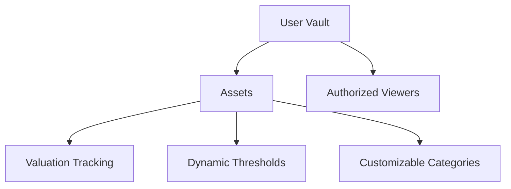

# EstimateBase: Smart Asset Value Tracking

A powerful, privacy-first blockchain solution for tracking, estimating, and monitoring digital asset values on the Stacks network.

## Overview

EstimateBase provides a comprehensive platform for:
- Securely registering and tracking digital assets
- Maintaining real-time and historical asset valuations
- Implementing dynamic value monitoring strategies
- Managing granular privacy and access controls
- Creating immutable audit trails for financial tracking

## Architecture

The system leverages a flexible vault-based architecture that enables sophisticated asset management with robust privacy controls.



### Core Components:
- **Vaults**: Secure containers for asset portfolios
- **Assets**: Detailed digital asset representations
- **Valuation History**: Comprehensive value tracking
- **Categories**: Flexible asset classification
- **Monitoring Thresholds**: Intelligent value alerts
- **Access Management**: Fine-grained permission controls

## Contract Documentation

### Primary Contract: estimate-base.clar

A versatile smart contract enabling sophisticated asset value management and tracking.

#### Key Data Structures:
- `assets`: Comprehensive asset detail storage
- `asset-history`: Immutable valuation records
- `user-categories`: Personalized asset classification
- `vaults`: Portfolio metadata management
- `authorized-viewers`: Controlled access mechanism
- `monitoring-thresholds`: Intelligent value monitoring

## Getting Started

### Prerequisites
- Clarinet CLI
- Stacks-compatible wallet
- Basic understanding of smart contract interactions

### Quick Start

1. Initialize a vault:
```clarity
(contract-call? .estimate-base set-category "portfolio" "My Digital Assets" none)
```

2. Register an asset:
```clarity
(contract-call? .estimate-base register-asset 
    "unique-asset-id" 
    "Digital Investment" 
    "Investments" 
    u1672531200 
    u10000 
    u12500 
    none 
    false)
```

3. Update asset valuation:
```clarity
(contract-call? .estimate-base update-asset-value "unique-asset-id" u13000)
```

## Development

### Local Testing
```bash
clarinet test
clarinet console
```

## Security Considerations

### Access Control
- Owner-authenticated operations
- Configurable viewer permissions
- Granular visibility settings

### Data Protection
- Encrypted asset details
- Immutable historical records
- Optional metadata management

### Best Practices
- Implement time-bounded access
- Regularly audit viewer permissions
- Use optional metadata for sensitive information

## Limitations
- Integer-based valuations
- No fractional asset support
- External threshold monitoring required

## Contributions
Open-source and community-driven. Contributions welcome!